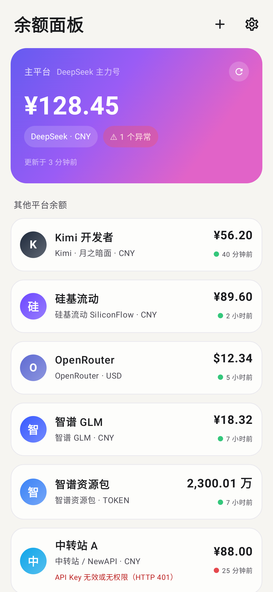
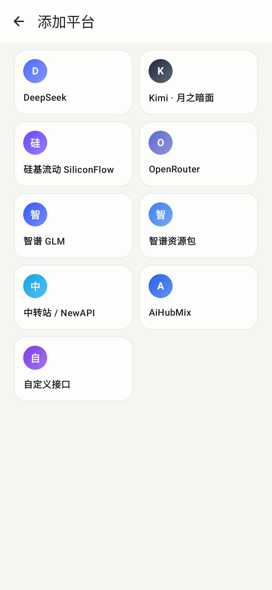
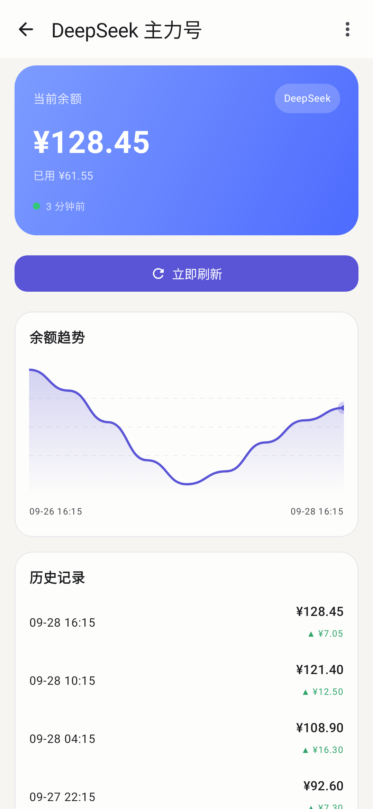

# 余额面板 Balance Panel

> 纯本地的大模型 API 余额监控面板 —— 自动查余额、画趋势图，桌面小组件随时瞄一眼。

<table align="center">
  <tr>
    <td align="center" width="33%"></td>
    <td align="center" width="33%"></td>
    <td align="center" width="33%"></td>
  </tr>
</table>

---

## 🤖 一 · 如果你是 AI

### 项目说明

这是一个 **Android 余额监控面板**：把用户在各个大模型平台 / 中转站的账号集中管理，App **直连各平台官方接口**查询余额，保存历史快照并绘制趋势图，同时提供 Glance 桌面小组件，全程不经过任何第三方服务器。

- 技术栈：Kotlin + Jetpack Compose（Material 3）+ Glance 小组件 + Room + WorkManager + DataStore + OkHttp
- 最低支持 Android 8.0（API 26），目标 Android 15（API 35）
- API Key 使用本机 **Android Keystore（AES-256/GCM）加密**存储，无任何第三方统计/上报 SDK

### 构建方法

```bash
./gradlew assembleDebug        # 输出 app/build/outputs/apk/debug/app-debug.apk
./gradlew testDebugUnitTest    # 单元测试 + Robolectric 界面截图回归
```

首次构建需 Android Studio（Ladybug+）或已配置 `sdk.dir` 的 Android SDK，JDK 17。

---

## 🙋 二 · 如果你是人类

### 这是什么？

安卓手机上的**大模型余额监控小工具** —— 各个平台的 API 账号还剩多少钱，打开一眼看清。

**纯本地运行、没有广告、完全免费**

### 支持哪些平台？

- **DeepSeek**、**Kimi · 月之暗面**、**硅基流动**、**OpenRouter**：填入 API Key 即可自动查询
- **智谱 GLM**：现金余额、资源包 Token 额度分开统计
- **中转站 / NewAPI**、**AiHubMix**：兼容 OneAPI / NewAPI 架构的自建站点
- **自定义接口**：其他任何有余额查询接口的平台，填入接口地址 + JSON 字段路径即可接入

### 怎么安装？

把 `dist/BalancePanel-v1.0.2-debug.apk` 传到手机上安装

### 怎么用？

1. 点右上角 **+** 选择平台，填入 API Key 保存，余额自动查询
2. 点平台卡片看**余额趋势图**和历史记录；长按卡片可拖动排序
3. 长按桌面 → 小组件 → 添加「单账号余额」，选一个账号放在桌面，点 **↻** 立即刷新
4. 设置里可开启**定时自动刷新**（15 分钟 ~ 6 小时）和**启动时自动刷新**

> 某次刷新失败（断网、限流）不会清空已有余额——界面继续显示上次已知数值，下次成功自动覆盖。
